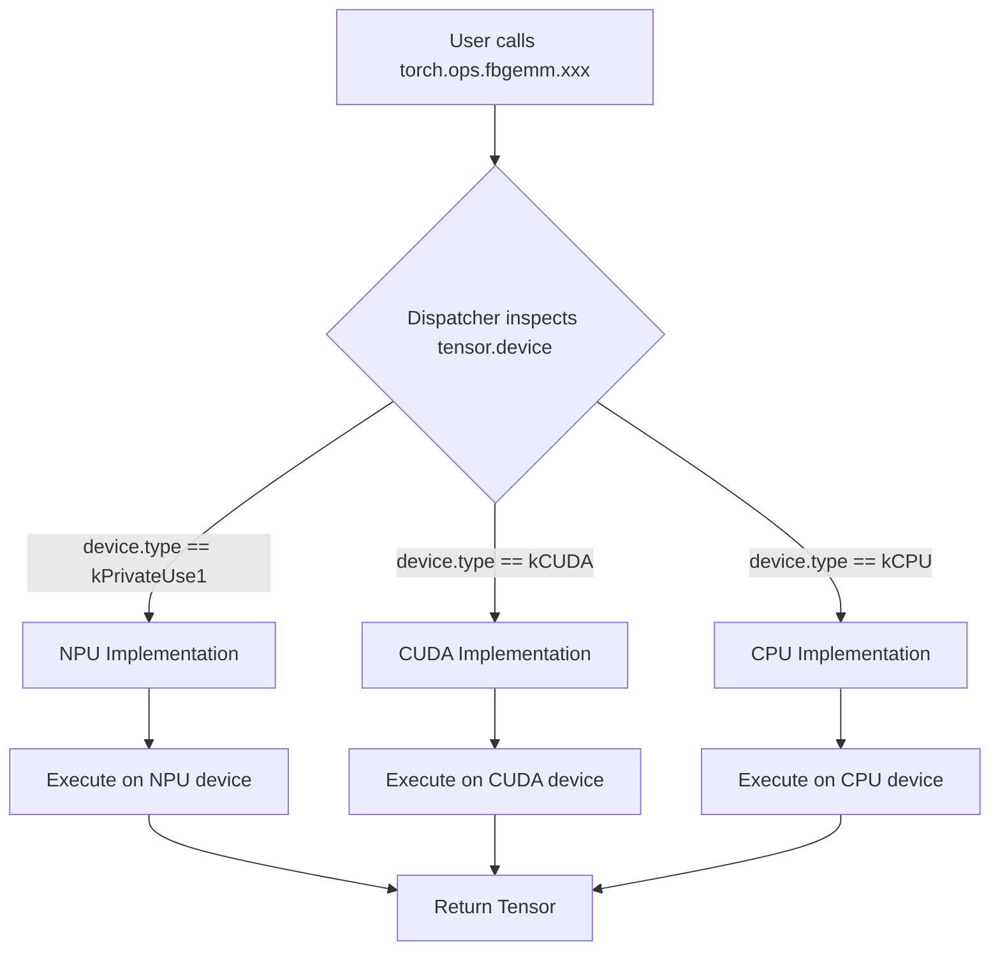
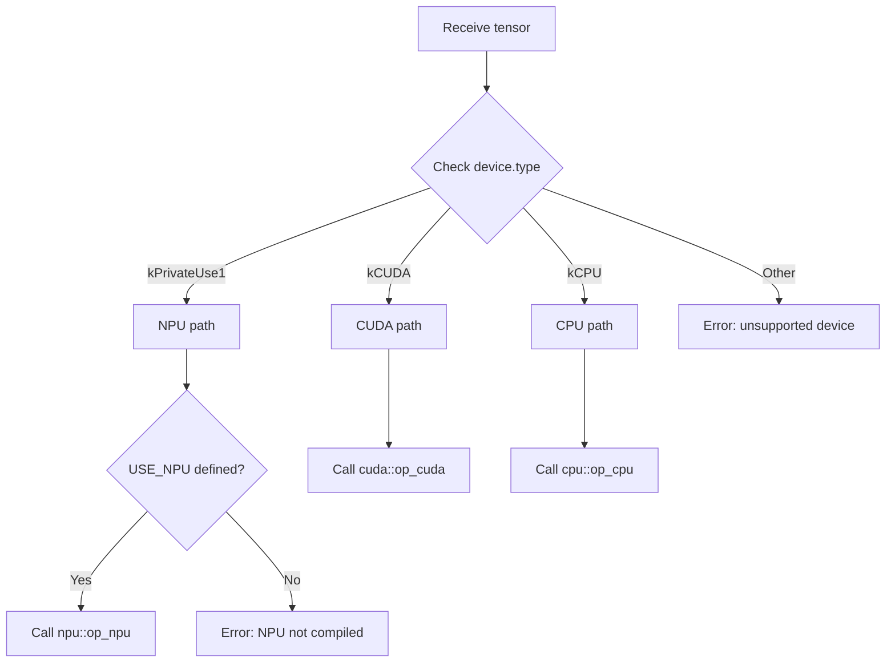

# FBGEMM NPU Backend - Technical Specifications

**Project**: FBGEMM_GPU Ascend NPU Backend Adaptation
**Version**: 1.0
**Status**: Design Phase
**Date**: 2026-01-24

---

## Table of Contents

1. [System Architecture](#1-system-architecture)
2. [Directory Structure](#2-directory-structure)
3. [Component Specifications](#3-component-specifications)
4. [Type System](#4-type-system)
5. [Operator Dispatch Mechanism](#5-operator-dispatch-mechanism)
6. [Build System](#6-build-system)
7. [Error Handling and Logging](#7-error-handling-and-logging)
8. [Testing Requirements](#8-testing-requirements)
9. [Performance Requirements](#9-performance-requirements)
10. [Integration Requirements](#10-integration-requirements)

---

## 1. System Architecture

### 1.1 Architecture Overview

FBGEMM NPU backend adopts a **four-layer architecture** with complete decoupling from existing CUDA/CPU implementations:

```
┌─────────────────────────────────────────┐
│  PyTorch User Layer                      │
│  torch.ops.fbgemm.xxx(tensor)           │
└──────────────┬──────────────────────────┘
               │ Automatic device detection
┌──────────────▼──────────────────────────┐
│  Unified Dispatcher Layer               │
│  Routes based on tensor.device().type() │
└──────────────┬──────────────────────────┘
               │
     ┌─────────┼─────────┬─────────┐
     │         │         │         │
┌────▼───┐ ┌──▼────┐ ┌──▼────┐ ┌──▼────┐
│ CUDA   │ │  CPU  │ │  NPU   │ │ ROCm  │
│ Impl   │ │ Impl  │ │ Impl   │ │ Impl  │
└────────┘ └───────┘ └───────┘ └───────┘
```

### 1.2 Design Principles

| Principle | Description | Implementation |
|-----------|-------------|----------------|
| **Zero Intrusion** | No modifications to CUDA/CPU code | All NPU code in `src/npu/` |
| **Complete Decoupling** | Independent development and maintenance | Separate compilation units |
| **Performance First** | Minimal routing overhead | ~10ns inline dispatch functions |
| **Optional Compilation** | NPU is opt-in | `USE_NPU=OFF` by default |
| **Automatic Routing** | Transparent device detection | Dispatcher inspects tensor device |

### 1.3 Device Routing Flow



---

## 2. Directory Structure

### 2.1 Complete Directory Tree

```
fbgemm_gpu/
├── src/
│   ├── sparse_ops/                    # Existing CUDA implementations (DO NOT MODIFY)
│   ├── quantize_ops/                  # Existing CUDA implementations (DO NOT MODIFY)
│   ├── npu/                           # NPU backend (NEW)
│   │   ├── dispatch/                  # Dispatcher layer
│   │   │   ├── dispatcher.h           # Inline dispatch functions
│   │   │   ├── sparse_ops.cpp         # Sparse op registration
│   │   │   └── quantize_ops.cpp       # Quantize op registration
│   │   ├── sparse_ops/                # NPU sparse operator wrappers
│   │   │   ├── invert_permute.cpp
│   │   │   ├── permute_1d.cpp
│   │   │   ├── permute_2d.cpp
│   │   │   ├── index_select_dim0.cpp
│   │   │   └── pack_segments.cpp
│   │   ├── quantize_ops/              # NPU quantization operator wrappers
│   │   │   ├── quantize.cpp
│   │   │   ├── dequantize.cpp
│   │   │   └── float_to_bfloat16.cpp
│   │   ├── utils/                     # NPU utility functions
│   │   │   ├── npu_ops_utils.h        # Device guards, macros
│   │   │   └── npu_type_utils.h       # Type mapping
│   │   ├── ascendc/                   # AscendC kernels (one directory per operator)
│   │   │   ├── invert_permute/
│   │   │   │   ├── op_host/
│   │   │   │   │   ├── invert_permute.cpp
│   │   │   │   │   └── invert_permute_tiling.h
│   │   │   │   └── op_kernel/
│   │   │   │       ├── invert_permute.cpp
│   │   │   │       └── invert_permute_kernel.h
│   │   │   ├── permute_1d/
│   │   │   ├── permute_2d/
│   │   │   ├── index_select_dim0/
│   │   │   └── pack_segments/
│   │   └── CMakeLists.txt             # NPU wrapper build config
│   └── ...
├── include/fbgemm_gpu/                # Public headers
│   └── npu/                           # NPU public interfaces (NEW)
│       └── npu_api.h
├── test/
│   ├── npu/                           # NPU-specific tests (NEW)
│   │   ├── sparse_ops_test.py
│   │   ├── quantize_ops_test.py
│   │   └── dispatch_test.py
│   ├── test_utils.py                  # Extended with NPU support
│   └── ...
└── CMakeLists.txt                     # Main build config (minimal modifications)
```

### 2.2 File Naming Conventions

| Component | Pattern | Example |
|-----------|---------|---------|
| AscendC host | `op_host/<op_name>.cpp` | `op_host/invert_permute.cpp` |
| AscendC tiling | `op_host/<op_name>_tiling.h` | `op_host/invert_permute_tiling.h` |
| AscendC kernel | `op_kernel/<op_name>.cpp` | `op_kernel/invert_permute.cpp` |
| NPU wrapper | `<op_category>/<op_name>.cpp` | `sparse_ops/invert_permute.cpp` |
| Tests | `<category>_test.py` | `sparse_ops_test.py` |

---

## 3. Component Specifications

### 3.1 Unified Dispatcher Layer

**Location**: `fbgemm_gpu/src/npu/dispatch/`

**Purpose**: Route operator calls to appropriate backend based on tensor device type.

**Key Requirements**:
1. Use `inline` functions for zero-overhead dispatch (~10ns)
2. Use forward declarations to avoid circular dependencies
3. Check `tensor.device().type()` for routing decision
4. Support conditional compilation with `#ifdef USE_NPU`

**Interface Specification**:

```cpp
// dispatcher.h
#pragma once

#include <ATen/Tensor.h>

namespace fbgemm_gpu::dispatch {

// Forward declarations
namespace cuda {
  Tensor invert_permute_cuda(const Tensor& permute);
  Tensor permute_1d_cuda(const Tensor& input, const Tensor& indices);
}
namespace cpu {
  Tensor invert_permute_cpu(const Tensor& permute);
  Tensor permute_1d_cpu(const Tensor& input, const Tensor& indices);
}

#ifdef USE_NPU
namespace npu {
  Tensor invert_permute_npu(const Tensor& permute);
  Tensor permute_1d_npu(const Tensor& input, const Tensor& indices);
}
#endif

// Inline dispatch function
inline Tensor invert_permute(const Tensor& permute) {
  auto device_type = permute.device().type();

  if (device_type == c10::kPrivateUse1) {
#ifdef USE_NPU
    return npu::invert_permute_npu(permute);
#else
    TORCH_CHECK(false, "NPU support not compiled in");
#endif
  } else if (device_type == c10::kCUDA) {
    return cuda::invert_permute_cuda(permute);
  } else {
    return cpu::invert_permute_cpu(permute);
  }
}

} // namespace fbgemm_gpu::dispatch
```

**Registration Specification**:

```cpp
// sparse_ops.cpp
#include "fbgemm_gpu/src/npu/dispatch/dispatcher.h"
#include <torch/library.h>

// Register with CatchAll dispatch key
TORCH_LIBRARY_IMPL(fbgemm, CatchAll, m) {
  m.impl("invert_permute", &fbgemm_gpu::dispatch::invert_permute);
  m.impl("permute_1d", &fbgemm_gpu::dispatch::permute_1d);
  // ... one per operator
}
```

### 3.2 NPU Operator Wrapper Layer

**Location**: `fbgemm_gpu/src/npu/sparse_ops/` or `fbgemm_gpu/src/npu/quantize_ops/`

**Purpose**: Provide PyTorch-compatible C++ interface that calls AscendC kernels.

**Key Requirements**:
1. Use `AT_DISPATCH_*` macros for type dispatch
2. Validate input parameters (device, dtype, dimensions)
3. Use `TENSOR_ON_NPU` macro for device checking
4. Use `NPUDeviceGuard` for device management
5. Call AscendC kernel via ACLNN API or custom .so
6. Return PyTorch tensor on NPU device

**Implementation Template**:

```cpp
// sparse_ops/invert_permute.cpp
#include "fbgemm_gpu/npu/utils/npu_ops_utils.h"
#include <ATen/Tensor.h>
#include <torch/library.h>

#ifdef USE_NPU

namespace fbgemm_gpu::npu {

Tensor invert_permute_npu(const Tensor& permute) {
  // Device check
  TENSOR_ON_NPU(permute);

  // Device guard
  NPUDeviceGuard guard(permute);

  // Parameter validation
  TORCH_CHECK(
    permute.dim() == 1,
    "invert_permute_npu expects 1D tensor, got dim=",
    permute.dim());

  TORCH_CHECK(
    permute.scalar_type() == at::kInt ||
    permute.scalar_type() == at::kLong,
    "invert_permute_npu only supports int32/int64, got ",
    permute.scalar_type());

  // Type dispatch
  return AT_DISPATCH_INDEX_TYPES(
    permute.scalar_type(),
    "invert_permute_npu",
    [&] {
      return invert_permute_npu_impl<index_t>(permute);
    });
}

template <typename index_t>
Tensor invert_permute_npu_impl(const Tensor& permute) {
  // Create output tensor
  Tensor output = at::empty_like(permute);

  // Call AscendC kernel (via ACLNN or custom .so)
  if constexpr (std::is_same_v<index_t, int32_t>) {
    EXEC_NPU_CMD(aclnnInvertPermuteInt32, permute, output);
  } else {
    EXEC_NPU_CMD(aclnnInvertPermuteInt64, permute, output);
  }

  return output;
}

} // namespace fbgemm_gpu::npu

#endif // USE_NPU
```

### 3.3 AscendC Kernel Layer

**Location**: `fbgemm_gpu/src/npu/ascendc/<operator_name>/`

**Purpose**: Implement NPU computation logic using AscendC API.

**Directory Structure per Operator**:
```
<operator_name>/
├── op_host/
│   ├── <op_name>.cpp          # Tiling, shape inference, type inference
│   └── <op_name>_tiling.h     # Tiling data structures
└── op_kernel/
    ├── <op_name>.cpp          # AscendC computation kernel
    └── <op_name>_kernel.h     # Kernel function declaration
```

**Layer Responsibilities**:

| Layer | Responsibilities |
|-------|------------------|
| **op_host** | - Tiling strategy (blockDim, threadsPerBlock)<br>- Shape inference<br>- Type inference<br>- Kernel selection (TilingKey) |
| **op_kernel** | - Actual computation using AscendC API<br>- Read tiling parameters<br>- Access global/local memory<br>- Write results |

**Tiling Mechanism**:
- Calculate number of AI Cores needed (blockDim)
- Calculate threads per block
- Select kernel instance based on data type
- Divide data into blocks for parallel processing

### 3.4 NPU Utility Functions

**Location**: `fbgemm_gpu/src/npu/utils/`

**File: npu_ops_utils.h**

```cpp
#pragma once

#include <ATen/Tensor.h>
#include <c10/core/DeviceType.h>

#ifdef USE_NPU

namespace fbgemm_gpu::npu {

// Device check macro
#define TENSOR_ON_NPU(tensor)                                         \
  TORCH_CHECK(                                                       \
    (tensor).device().type() == c10::kPrivateUse1,                  \
    "Tensor must be on NPU device but is on device: ",              \
    (tensor).device());

// NPU device guard (RAII pattern)
class NPUDeviceGuard {
  c10::Device prev_device_;
public:
  explicit NPUDeviceGuard(const at::Tensor& tensor)
    : prev_device_(c10::current_device()) {
    c10::set_device(tensor.device());
  }

  ~NPUDeviceGuard() {
    c10::set_device(prev_device_);
  }

  NPUDeviceGuard(const NPUDeviceGuard&) = delete;
  NPUDeviceGuard& operator=(const NPUDeviceGuard&) = delete;
};

// ACLNN error checking macro
#define CHECK_NPU_CMD(cmd)                                          \
  do {                                                              \
    auto ret = (cmd);                                               \
    if (ret != 0) {                                                 \
      TORCH_CHECK(false, "NPU command failed: " #cmd ", ret=", ret);\
    }                                                               \
  } while(0)

// NPU execution macro (placeholder for actual API)
#define EXEC_NPU_CMD(op, ...)                                       \
  do {                                                              \
    CHECK_NPU_CMD(op(__VA_ARGS__));                                 \
  } while(0)

} // namespace fbgemm_gpu::npu

#endif // USE_NPU
```

**File: npu_type_utils.h**

```cpp
#pragma once

#include <ATen/Tensor.h>
#include <c10/core/ScalarType.h>
#include <torch/library.h>

#ifdef USE_NPU

#include "ascenddec.h"  // AscendC type definitions

namespace fbgemm_gpu::npu {

// Type mapping: PyTorch -> AscendC
inline ge::DataType get_ge_dtype(c10::ScalarType type) {
  switch(type) {
    case c10::kInt: return ge::DT_INT32;
    case c10::kLong: return ge::DT_INT64;
    case c10::kFloat: return ge::DT_FLOAT;
    case c10::kHalf: return ge::DT_FLOAT16;
    case c10::kBFloat16: return ge::DT_BF16;
    default:
      TORCH_CHECK(false, "Unsupported dtype for NPU: ", toString(type));
  }
}

// Device detection
inline bool is_npu_tensor(const at::Tensor& tensor) {
  return tensor.device().type() == c10::kPrivateUse1;
}

} // namespace fbgemm_gpu::npu

#endif // USE_NPU
```

---

## 4. Type System

### 4.1 Type Mapping Table

| PyTorch ScalarType | C++ Type | AscendC DataType | ACLNN API Suffix |
|--------------------|----------|-----------------|------------------|
| `kInt` | `int32_t` | `ge::DT_INT32` | `Int32` |
| `kLong` | `int64_t` | `ge::DT_INT64` | `Int64` |
| `kFloat` | `float` | `ge::DT_FLOAT` | `Float` |
| `kHalf` | `float16_t` | `ge::DT_FLOAT16` | `Float16` |
| `kBFloat16` | `bfloat16_t` | `ge::DT_BF16` | `Bf16` |

### 4.2 Type Dispatch Pattern

NPU wrappers must use PyTorch's `AT_DISPATCH_*` macros for type safety:

```cpp
// For index types (int32, int64)
AT_DISPATCH_INDEX_TYPES(scalar_type, "op_name", [&] {
  return op_impl<index_t>(args...);
});

// For floating point types (float32, float16, bfloat16)
AT_DISPATCH_FLOATING_TYPES_AND_HALF(scalar_type, "op_name", [&] {
  return op_impl<scalar_t>(args...);
});

// For all numeric types
AT_DISPATCH_ALL_TYPES(scalar_type, "op_name", [&] {
  return op_impl<scalar_t>(args...);
});
```

### 4.3 Type Constraints by Operator Category

| Operator Category | Supported Types | Notes |
|------------------|----------------|-------|
| **Sparse Ops** | int32, int64 | Index-based operations |
| **Quantization Ops** | float32, float16, bfloat16, int8 | Quantize/dequantize |
| **Arithmetic Ops** | float32, float16, bfloat16 | Computation operations |

---

## 5. Operator Dispatch Mechanism

### 5.1 PyTorch Dispatch Priority

PyTorch's dispatch system evaluates operators in this priority order:

1. **Specific device keys** (CUDA, CPU, XLA) - highest priority
2. **CatchAll** - lowest priority, catches all remaining cases

NPU dispatcher uses `CatchAll` to intercept calls and inspect device type:

```cpp
TORCH_LIBRARY_IMPL(fbgemm, CatchAll, m) {
  // Dispatcher itself determines which backend to use
  m.impl("invert_permute", &fbgemm_gpu::dispatch::invert_permute);
}
```

### 5.2 Device Detection Logic



### 5.3 Registration Example

```cpp
// Existing CUDA registration (DO NOT MODIFY)
// fbgemm_gpu/src/sparse_ops/sparse_ops_gpu.cpp
TORCH_LIBRARY_IMPL(fbgemm, CUDA, m) {
  m.impl("invert_permute", &fbgemm_gpu::invert_permute_cuda);
  m.impl("permute_1d", &fbgemm_gpu::permute_1d_cuda);
}

// NPU registration (NEW file)
// fbgemm_gpu/src/npu/dispatch/sparse_ops.cpp
TORCH_LIBRARY_IMPL(fbgemm, CatchAll, m) {
  m.impl("invert_permute", &fbgemm_gpu::dispatch::invert_permute);
  m.impl("permute_1d", &fbgemm_gpu::dispatch::permute_1d);
}
```

---

## 6. Build System

### 6.1 CMake Configuration

**Main CMakeLists.txt Modifications** (minimal):

```cmake
# fbgemm_gpu/CMakeLists.txt

# NPU support - optional dependency
option(USE_NPU "Build with Ascend NPU support" OFF)

if(USE_NPU)
  # Find CANN toolkit
  if(NOT DEFINED CANN_PATH)
    set(CANN_PATH "/usr/local/Ascend" CACHE PATH "CANN installation path")
  endif()

  find_package(CANN REQUIRED)

  # Add NPU subdirectory
  add_subdirectory(src/npu)

  # Link NPU wrapper to main library
  target_link_libraries(fbgemm_gpu PRIVATE fbgemm_npu_wrapper)
endif()
```

**NPU CMakeLists.txt**:

```cmake
# fbgemm_gpu/src/npu/CMakeLists.txt

# Compile AscendC kernels first
add_subdirectory(ascendc)

# NPU wrapper library
add_library(fbgemm_npu_wrapper STATIC
  dispatch/sparse_ops.cpp
  dispatch/quantize_ops.cpp
  sparse_ops/invert_permute.cpp
  sparse_ops/permute_1d.cpp
  quantize_ops/quantize.cpp
  # ... other operators
)

target_link_libraries(fbgemm_npu_wrapper
  PUBLIC
    fbgemm_gpu::utils
    torch::torch
    ${CANN_LIBRARIES}
    ascendc_ops
)

target_include_directories(fbgemm_npu_wrapper
  PUBLIC
    ${CANN_INCLUDE_DIRS}
    ${CMAKE_CURRENT_SOURCE_DIR}
)
```

**AscendC CMakeLists.txt**:

```cmake
# fbgemm_gpu/src/npu/ascendc/CMakeLists.txt

# List of AscendC operators
set(NPU_ASCENDC_OPS
  invert_permute
  permute_1d
  permute_2d
  index_select_dim0
  pack_segments
)

set(NPU_ASCENDC_LIBS)

# Build each operator independently
foreach(op ${NPU_ASCENDC_OPS})
  add_subdirectory(${op})
  list(APPEND NPU_ASCENDC_LIBS ascendc_${op})
endforeach()

# Aggregate interface library
add_library(ascendc_ops INTERFACE)
target_link_libraries(ascendc_ops INTERFACE ${NPU_ASCENDC_LIBS})
```

**Per-Operator CMakeLists.txt Template**:

```cmake
# fbgemm_gpu/src/npu/ascendc/<op_name>/CMakeLists.txt

add_library(ascendc_${op_name} SHARED
  op_host/${op_name}.cpp
  op_kernel/${op_name}.cpp
)

target_compile_options(ascendc_${op_name} PRIVATE
  -I${CANN_INCLUDE_DIRS}
  -I${CMAKE_CURRENT_SOURCE_DIR}/op_host
  -I${CMAKE_CURRENT_SOURCE_DIR}/op_kernel
)
```

### 6.2 Two-Stage Compilation

```
Stage 1: AscendC Kernel Compilation
┌─────────────────────────────────────────┐
│ Input: op_host/*.cpp + op_kernel/*.cpp  │
│ Tool: AscendC Compiler (msopgen)       │
│ Output: lib<op_name>.so                │
└─────────────────────────────────────────┘
                    ↓
Stage 2: NPU Wrapper Compilation
┌─────────────────────────────────────────┐
│ Input: npu/sparse_ops/*.cpp + .so files│
│ Tool: CMake + CANN                      │
│ Output: libfbgemm_npu_wrapper.so       │
└─────────────────────────────────────────┘
```

### 6.3 Compilation Flags

| Configuration | CMake Flag | Behavior |
|--------------|-----------|----------|
| **Default** | (none) | Build CUDA/CPU only, NPU disabled |
| **NPU Enabled** | `-DUSE_NPU=ON` | Build NPU backend if CANN found |
| **CANN Path** | `-DCANN_PATH=/path/to/cann` | Specify custom CANN location |

### 6.4 Build Artifacts

```
build/
├── lib/
│   ├── libfbgemm_gpu.so              # Main library (no NPU dependency)
│   ├── libfbgemm_npu_wrapper.so       # NPU wrapper (requires USE_NPU=ON)
│   └── npu_ops/                       # AscendC kernel libraries
│       ├── libinvert_permute.so
│       ├── libpermute_1d.so
│       └── ...
└── npu/
    └── ascendc/
        ├── invert_permute/
        │   ├── op_host/
        │   └── op_kernel/
        └── ...
```

---

## 7. Error Handling and Logging

### 7.1 Error Handling Strategy

NPU operators must follow FBGEMM's error handling conventions:

1. **Device checks** before any computation
2. **Parameter validation** with clear error messages
3. **RAII device guards** for device management
4. **ACLNN error checking** for NPU API calls

### 7.2 Error Message Format

```cpp
// Good error messages (FBGEMM style)
TORCH_CHECK(
  permute.dim() == 1,
  "invert_permute_npu expects 1D tensor, got dim=",
  permute.dim(),
  ", shape=",
  permute.sizes());

// Bad (too simple)
TORCH_CHECK(permute.dim() == 1, "wrong dimensions");

// Bad (too verbose)
TORCH_CHECK(
  permute.dim() == 1,
  "The input tensor provided to the invert_permute operation on the NPU "
  "device must have exactly one dimension...");
```

### 7.3 Boundary Condition Handling

```cpp
Tensor invert_permute_npu(const Tensor& permute) {
  // Type validation
  TORCH_CHECK(
    permute.scalar_type() == at::kInt ||
    permute.scalar_type() == at::kLong,
    "invert_permute_npu only supports int32/int64, got ",
    permute.scalar_type());

  // Dimension validation
  TORCH_CHECK(
    permute.dim() == 1,
    "invert_permute_npu expects 1D tensor, got dim=",
    permute.dim());

  // Size validation (AscendC constraints)
  int64_t length = permute.numel();
  TORCH_CHECK(
    length >= 1 && length <= (1L << 31),
    "invert_permute_npu: tensor length must be in [1, 2^31], got ",
    length);

  // Empty tensor special case
  if (length == 0) {
    return at::empty_like(permute);
  }

  // Normal implementation
  // ...
}
```

### 7.4 Logging

Use PyTorch's standard logging system:

```cpp
#include <ATen/Logging.h>

Tensor invert_permute_npu(const Tensor& permute) {
  // Debug logging
  VLOG(1) << "invert_permute_npu called with shape: " << permute.sizes();

  // Performance tracking
  at::record_function_start("invert_permute_npu");

  Tensor output = /* ... compute ... */;

  at::record_function_end("invert_permute_npu");

  return output;
}
```

---

## 8. Testing Requirements

### 8.1 Testing Philosophy

**Key Principle**: NPU and GPU are in **different deployment environments**.
- **Do NOT** compare NPU vs GPU results
- **DO** compare NPU vs CPU results for correctness

### 8.2 Test Directory Structure

```
fbgemm_gpu/test/
├── npu/                           # NPU-specific tests
│   ├── sparse_ops_test.py         # Sparse operator tests
│   ├── quantize_ops_test.py       # Quantization operator tests
│   └── dispatch_test.py           # Dispatcher routing tests
└── test_utils.py                  # Extended with npu_unavailable
```

### 8.3 Test Framework

Use **unittest + Hypothesis** (consistent with FBGEMM):

```python
# test/npu/sparse_ops_test.py
import unittest
import hypothesis.strategies as st
import torch
from hypothesis import given, settings

from test_utils import npu_unavailable

class NPUInvertPermuteTest(unittest.TestCase):
  """Test invert_permute NPU implementation"""

  @unittest.skipIf(*npu_unavailable)
  @given(
    size=st.integers(min_value=1, max_value=10000),
    dtype=st.sampled_from([torch.int32, torch.int64]),
  )
  @settings(max_examples=20, deadline=None)
  def test_invert_permute_correctness(self, size: int, dtype: torch.dtype):
    """Test NPU vs CPU correctness"""
    # Generate input
    x = torch.randperm(size).to(dtype)

    # CPU reference
    y_cpu = torch.ops.fbgemm.invert_permute(x)

    # NPU computation
    x_npu = x.npu()
    y_npu = torch.ops.fbgemm.invert_permute(x_npu)

    # Verify results match
    torch.testing.assert_close(y_npu.cpu(), y_cpu, rtol=1e-5, atol=1e-5)

  @unittest.skipIf(*npu_unavailable)
  def test_invert_permute_empty_tensor(self):
    """Test empty tensor boundary case"""
    x = torch.tensor([], dtype=torch.int32)
    x_npu = x.npu()

    y_npu = torch.ops.fbgemm.invert_permute(x_npu)
    y_cpu = torch.ops.fbgemm.invert_permute(x)

    torch.testing.assert_close(y_npu.cpu(), y_cpu)
```

### 8.4 Test Coverage Requirements

| Coverage Type | Requirement | Details |
|--------------|-------------|---------|
| **Unit Test Coverage** | > 90% | All NPU operators must have tests |
| **Type Coverage** | 4+ types | int32, int64, float32, float16, bfloat16 |
| **Edge Cases** | 5+ scenarios | Empty, single element, large, non-contiguous, invalid |
| **Device Routing** | NPU + CPU | Verify dispatcher routes correctly |
| **Error Handling** | All error paths | Test error messages and conditions |

### 8.5 Test Utility Extensions

```python
# test_utils.py (extend existing file)

# NPU availability check (consistent with gpu_unavailable)
npu_unavailable: tuple[bool, str] = (
  not hasattr(torch, 'npu') or not torch.npu.is_available(),
  "NPU is not available"
)

npu_available: bool = not npu_unavailable[0]
```

### 8.6 CI/CD Separation

**Separate CI environments**:

```yaml
# GPU CI (existing)
name: GPU Tests
runs-on: [self-hosted, gpu]
steps:
  - run: python -m unittest test.sparse_ops_test

# NPU CI (new)
name: NPU Tests
runs-on: [self-hosted, npu]
steps:
  - run: python -m unittest test.npu.sparse_ops_test
```

---

## 9. Performance Requirements

### 9.1 Performance Targets

| Operator | Target vs CPU | Target vs CUDA | Notes |
|----------|--------------|----------------|-------|
| **invert_permute** | > 10x faster | Similar | Index manipulation |
| **permute_1d** | > 5x faster | Within 2x | Memory-bound |
| **permute_2d** | > 5x faster | Within 2x | Memory-bound |
| **index_select_dim0** | > 8x faster | Similar | Gather operation |
| **quantize** | > 15x faster | Within 2x | Computation-bound |

### 9.2 Performance Testing

```python
# test/npu/benchmark.py
import torch
import time

def benchmark_operator(op_name, inputs, num_iterations=100):
  """Benchmark NPU operator performance"""

  # Warmup
  for _ in range(10):
    torch.ops.fbgemm.getattr(op_name)(*inputs)

  # Timing
  start = time.time()
  for _ in range(num_iterations):
    result = torch.ops.fbgemm.getattr(op_name)(*inputs)
  torch.npu.synchronize()
  end = time.time()

  avg_time_ms = (end - start) / num_iterations * 1000
  return avg_time_ms

# Example usage
x = torch.randn(1000000, dtype=torch.float32).npu()
time_ms = benchmark_operator("quantize", (x,))
print(f"Average time: {time_ms:.3f} ms")
```

### 9.3 Profiling and Optimization

1. **Profile AscendC kernels** using CANN tools
2. **Optimize tiling parameters** (blockDim, threadsPerBlock)
3. **Minimize data transfers** between NPU and host
4. **Use unified buffer** for intermediate results

---

## 10. Integration Requirements

### 10.1 Backward Compatibility

- ✅ Existing CUDA/CPU code **must not change**
- ✅ Default behavior (USE_NPU=OFF) **must be identical**
- ✅ PyTorch Python API **must be unchanged**
- ✅ User code **requires no modifications**

### 10.2 Forward Compatibility

- ✅ New operators can be added to NPU backend
- ✅ Existing operators can be optimized
- ✅ NPU support can be enabled/disabled via CMake

### 10.3 API Compatibility

**User API remains identical**:

```python
# These calls work automatically on any device
import torch

# CPU tensor
x_cpu = torch.tensor([1, 2, 3])
y_cpu = torch.ops.fbgemm.invert_permute(x_cpu)  # Calls CPU impl

# CUDA tensor (if available)
x_cuda = x_cpu.cuda()
y_cuda = torch.ops.fbgemm.invert_permute(x_cuda)  # Calls CUDA impl

# NPU tensor (if torch_npu installed)
x_npu = x_cpu.npu()
y_npu = torch.ops.fbgemm.invert_permute(x_npu)  # Calls NPU impl
```

### 10.4 Documentation Requirements

1. **Build Instructions**: How to compile with USE_NPU=ON
2. **Operator Guide**: How to implement new NPU operators
3. **Migration Guide**: Moving from CUDA to NPU deployment
4. **Troubleshooting**: Common issues and solutions

### 10.5 Code Review Checklist

Before submitting NPU code for review:

- [ ] All code in `src/npu/` directory
- [ ] Zero modifications to CUDA/CPU files
- [ ] Compilation works with USE_NPU=OFF
- [ ] Compilation works with USE_NPU=ON (when CANN available)
- [ ] All tests pass (NPU vs CPU correctness)
- [ ] Error messages follow FBGEMM style
- [ ] Code follows FBGEMM naming conventions
- [ ] Inline comments for complex logic
- [ ] No hardcoded paths or assumptions
- [ ] Type dispatch implemented correctly
- [ ] Device checks in all NPU wrappers

---

## Appendix A: Operator Priority Matrix

| Priority | Operator | Category | Complexity | Rationale |
|----------|----------|----------|-----------|-----------|
| **P0** | invert_permute | Sparse | Low | Reference implementation |
| **P0** | permute_1d | Sparse | Low | Core recommendation op |
| **P0** | permute_2d | Sparse | Low | Core recommendation op |
| **P0** | index_select_dim0 | Sparse | Medium | Embedding lookup |
| **P1** | pack_segments | Sparse | Medium | Variable-length sequences |
| **P1** | quantize | Quantize | Low | Model compression |
| **P1** | dequantize | Quantize | Low | Model compression |
| **P2** | float_to_bfloat16 | Quantize | Low | Precision conversion |
| **P2** | split_embedding_lookup | Embedding | High | Advanced feature |

---

## Appendix B: Reference Implementations

### B.1 AscendC Kernel Example (invert_permute)

**File**: `ascendc/invert_permute/op_host/invert_permute.cpp`

```cpp
#include "invert_permute_tiling.h"
#include "kernel_operatorop.h"

namespace ge {
class OpKernelInvertPermute : public OpKernel {
public:
  Status Compute() {
    // Get input tensor
    Tensor input = context.GetInput(0);
    Tensor output = context.GetOutput(0);

    // Get tiling data
    const InvertPermuteTilingData* tiling = reinterpret_cast<
      const InvertPermuteTilingData*>(GetTilingData());

    // Launch kernel
    InvertPermuteKernel<<<tiling->blockDim, tiling->threadsPerBlock>>>(
      input.GetData(), output.GetData(), input.GetNumElements());

    return SUCCESS;
  }
};

// Register kernel
REGISTER_OP_KERNEL(InvertPermute, OpKernelInvertPermute);
}
```

### B.2 NPU Wrapper Example

**File**: `sparse_ops/invert_permute.cpp`

```cpp
#include "fbgemm_gpu/npu/utils/npu_ops_utils.h"
#include <ATen/Tensor.h>
#include <torch/library.h>

#ifdef USE_NPU

namespace fbgemm_gpu::npu {

Tensor invert_permute_npu(const Tensor& permute) {
  TENSOR_ON_NPU(permute);
  NPUDeviceGuard guard(permute);

  TORCH_CHECK(
    permute.dim() == 1,
    "invert_permute_npu expects 1D tensor, got dim=",
    permute.dim());

  return AT_DISPATCH_INDEX_TYPES(
    permute.scalar_type(),
    "invert_permute_npu",
    [&] {
      return invert_permute_npu_impl<index_t>(permute);
    });
}

template <typename index_t>
Tensor invert_permute_npu_impl(const Tensor& permute) {
  Tensor output = at::empty_like(permute);

  if constexpr (std::is_same_v<index_t, int32_t>) {
    EXEC_NPU_CMD(aclnnInvertPermuteInt32, permute, output);
  } else {
    EXEC_NPU_CMD(aclnnInvertPermuteInt64, permute, output);
  }

  return output;
}

} // namespace fbgemm_gpu::npu

#endif // USE_NPU
```

---

**Document Status**: Complete
**Version**: 1.0
**Last Updated**: 2026-01-24
